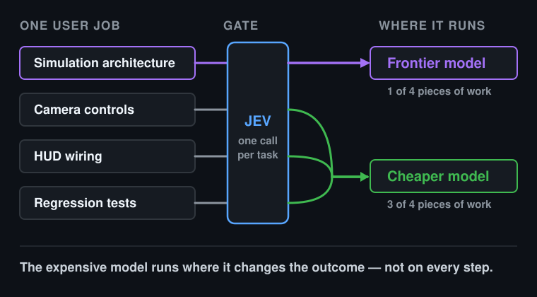
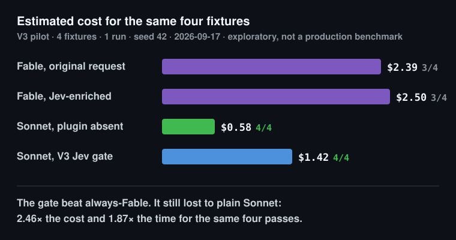
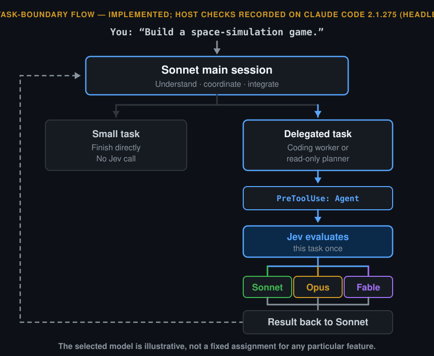

<div align="center">


# jev-gate

### Not every coding task needs your best model.

Jev-powered model routing for Claude Code.<br>
An experiment in using frontier intelligence for the hard parts—not every part.

[](https://github.com/MongLong0214/jev-gate/actions/workflows/ci.yml)
[](#try-v5)
[](#results)
[](#try-v5)

[The idea](#the-idea) · [lean (new)](#lean--a-second-separate-mode-in-development) · [How V5 works](#how-v5-works-legacy-routing-modes) · [Try V5](#try-v5) · [What is verified](#what-is-verified-and-what-is-not) · [Results](#results) · [Build with us](#build-with-us)

</div>

> **Status · September 18, 2026 · v0.2.0.** V5 turns one request into a judged workflow: Jev decides the execution
> shape, a strong read-only planner decomposes the job, a Sonnet coordinator runs the plan behind an execution guard,
> and Jev picks a tier for every planner and worker dispatch. The mechanism was **observed end to end on Claude Code
> 2.1.275/2.1.276** (headless and interactive). **No cost or time benefit is established**: the whole-job comparison was
> stopped after one cell for budget reasons, and in that cell every task routed to the same tier. See
> [What is verified](#what-is-verified-and-what-is-not) and [Results](#results). Contract:
> [#21 PRD](https://github.com/MongLong0214/jev-gate/issues/21) → [#22 ADR](https://github.com/MongLong0214/jev-gate/issues/22).
> Release: [v0.2.0](https://github.com/MongLong0214/jev-gate/releases/tag/v0.2.0). Next work and current state:
> [HANDOFF.md](HANDOFF.md).

## The idea

You ask your coding agent:

> “Build a space-simulation game.”

That is one request, but many different jobs: work out the physics, design the state model, implement camera controls, connect the HUD, and test the result.

<p align="center">
  
</p>

**Why give all of those jobs the same model?**

`jev-gate` explores a different default: **Sonnet coordinates. Jev evaluates the next delegated task. A suitable Claude model does the work.**

The question is not just *“Is this project hard?”* It is *“Does this next piece of work need a frontier model?”*

We are not aiming for hundreds of tiny agents. The useful unit is a coherent outcome—camera controls and their tests, for example—not each file read. Handoffs, repeated exploration, and integration all have costs. The gate only helps if it saves more than it adds.

## `lean` — a second, separate mode (in development)

`off`, `native` and `auto` below are the **legacy routing modes**: Gate A, a planner, a task graph, tier routing and a
root guard. `lean` shares none of that machinery. It is additive, off by default, and implemented but **not measured**.

The hypothesis it tests is narrow: on an ordinary request in a session that already has history, Jev picks which
complete prior interaction groups a fresh worker still needs, and the hook hands that packet to **one**
`jev-gate:executor` running on your own inherited model, with your auto-compact untouched.

```text
your request (normal auto-compact ON)
 -> local checks: mode, key, readable host transcript, mandatory layer fits, optional groups exist
 -> no optional evidence, no key, unknown source: native, and zero requests
 -> ONE batched Jev request: work shape, handoff scope, keep/omit per group
 -> short/unclear/needs-context/forbidden/nothing-actually-omitted: native, and the call still cost what it cost
 -> otherwise: one short recommendation carrying an opaque marker (never the packet itself)
 -> you may ignore it; if the root does call the executor, PreToolUse patches that one call's prompt
 -> the executor implements and checks normally and reports in prose; the root integrates as usual
```

What that does and does not mean:

- **Jev selects existing history. It does not summarise, delete or rewrite anything.** Your transcript, your compact
  summary, your CLAUDE.md and your permissions are untouched.
- **Your current words, every active human turn and the whole supported compact summary are always carried.** Whether
  they fit is decided from their actual bytes, not from a post-compact token total (that number includes the static
  prefix).
- **Model inheritance is not free context.** A custom subagent has its own system prompt and may not have the parent's
  auto-memory, already-invoked skills or root-only tools. The first root turn and the final integration still happen,
  and the worker loads its own prefix.
- **A smaller packet is not a saving.** Fewer packet bytes, more Jev calls or fewer root turns establish nothing.
  Missing history can cause rereads and repairs that cost more than was saved. No number here is measured yet.
- **The comparisons are ordinary Claude with normal auto-compact (`native_auto`) and a deterministic recency packet
  (`recent_packet`), not a strawman.** See [#29](https://github.com/MongLong0214/jev-gate/issues/29).
- **Explicit `lean` is consent to the documented export.** The current request, the mandatory layer and the enumerated
  groups go to TypeSafe. Credential screening is a conventional local pattern check, best effort — not universal
  protection and not a zero-retention guarantee.
- **The recommendation can be ignored, and nothing blocks the root if it is.** There is no guard and no deny-list in
  `lean`.

```sh
npm run build
node scripts/pack.mjs dist-pack --profile lean     # one executor, the lean hook set
JEV_GATE_MODE=lean node dist/cli.js doctor

cd /path/to/your/project
JEV_GATE_MODE=lean CLAUDE_CODE_FORK_SUBAGENT=0 CLAUDE_CODE_DISABLE_BACKGROUND_TASKS=1 \
claude --model sonnet --plugin-dir "$PLUGIN_DIR"
```

Load one profile at a time: the lean artifact ships only `agents/executor.md`, and selecting a legacy mode there is
diagnosed (`profile_mode_mismatch`) rather than starting a guard for roles it does not install.

Specification: [#21 PRD](https://github.com/MongLong0214/jev-gate/issues/21),
[#22 ADR](https://github.com/MongLong0214/jev-gate/issues/22),
[#33](https://github.com/MongLong0214/jev-gate/issues/33)–[#36](https://github.com/MongLong0214/jev-gate/issues/36),
[#29 measurement](https://github.com/MongLong0214/jev-gate/issues/29).

## How V5 works (legacy routing modes)

One request becomes a judged workflow. Jev is asked at every decision point, because a judgment costs about $0.0001 and
returns in under a second; the expensive models are asked only where a decision is hard.

```text
your request
  └─ Gate A  Jev: one direct conversation, or a decomposed job?
       ├─ direct        → Sonnet works normally, no plan, no guard
       └─ orchestrated  → strong planner (Opus, or Fable when Jev says the uncertainty warrants it)
                            reads the repository and returns a specification per task: interfaces, data shapes,
                            invariants, the files it inspected, and what it could not resolve
                          Sonnet coordinates: it dispatches ready tasks and integrates results, but cannot
                            implement the job itself while orchestration is active
                            └─ Gate B  Jev: which tier runs this task? fast · standard · deep · frontier
                            └─ a deterministic check: does the reply report every required check as passed?
                          a broken planning assumption returns to the planner, not to improvisation
```

**Sonnet runs the plan; it does not invent the important parts of it.** V4 left decomposition to the coordinator, and on
four small jobs it never delegated at all ([results](#results)). V5 moves that decision to Jev and the planner. The
planner may add optional `spec`/`uncertainty` context per task; neither field is required by the schema.

**Code owns acceptance.** A worker's result unlocks its dependents only when the reply reports every required check of
its task contract as passed. That is a deterministic check, not a Jev call — the normal path no longer makes a Gate C
HTTP request. A `worker_reported` accept is not independent proof that the code works; historical Gate C `result_*`
records from before this change are still read as history.

**Uncertainty preserves the default.** A tie, a low confidence, an abstention or any HTTP failure keeps the call that was
already going to happen. A tier above standard additionally requires a concrete upgrade basis in the task itself —
`fast` is below `standard` and is not gated by it.

| Tier | Model | Reasoning effort | Used for |
|---|---|---|---|
| fast | `haiku` | requested `low` — **not applied by the host for this model** | mechanical, fully specified work |
| standard | `sonnet` | session default | bounded implementation under established contracts |
| deep | `opus` | `high` | unresolved interacting constraints, or an observed reasoning failure |
| frontier | `fable` | `xhigh` | exceptional foundational uncertainty |

Planner dispatches use the deep and frontier tiers only. Tiers are abstract on purpose: the model names are a per-host
map, so the same policy can move to another coding host later.

<details>
<summary><strong>Technical boundary: exactly where the gates run</strong></summary>

**Gate A** runs on a root `UserPromptSubmit` in `auto` with a `prompt_id`. Without a prompt identity there is no job and
no guard. Blank input, slash commands, child callers, a missing key or an invalid config make no request.

**The guard** is an allow-list and is active only while a job is orchestrated: the root may use Read, Grep, Glob, LS,
WebFetch, WebSearch, AskUserQuestion, TodoWrite, the Task tools, ListAgents and owned Agent calls. Everything else is
denied with a fixed reason. Named root tools are blocked and unknown tools are declined; this is a product execution
boundary, not a sandbox. A disabled or crashed hook removes it.

**Gate B** runs for a new eligible owned dispatch: foreground, no `model` pin, no `resume`/`agentId`/`name`/`team_name`/
`isolation`/`fork`, no concrete `CLAUDE_CODE_SUBAGENT_MODEL`, a valid `[JEV_TASK rev=<n> id=<id>]` marker naming a task
of the current plan revision whose dependencies are accepted, deliverables disjoint from running tasks, and the composed
contract within 64 KiB. The patch returns the complete original input with `subagent_type`, `model` and the appended
contract changed; permissions, role and every other field survive.

**Gate C** (the Jev HTTP call that could tighten an already-accepted reply to `rework`/`replan`) is **removed from the
normal path**. Acceptance is the deterministic required-check completeness judgment described above; it is the only
thing that runs after a worker completes. Historical `result_intent`/`result_result`/advisory records written by Gate C
before this change remain readable as history.

**The plan-time scope gate is removed.** Earlier revisions asked Jev one `one_task | split | under_specified` question
per parsed plan before any worker ran; that call no longer happens.

Bounds per job: two planning attempts, two replans, two attempts per task, one parallel worker by default
(`maxParallelWorkers`, configurable — parallelism is not offered as a speed feature). Job state lives in one
private file per session under `$XDG_STATE_HOME/jev-gate/jobs/` (0700/0600, atomic writes, superseded generations kept as
history). Any failure — missing key, timeout (one deadline covering headers and body), HTTP 401/422/429/529, invalid
response, oversized input — preserves the native call with a fixed stderr code. There are no retries.

</details>

## Try V5

Requirements: **Node.js 22+**, **official Claude Code signed in with a Claude.ai subscription** (the recorded checks used
2.1.275 and 2.1.276 on macOS), and a **TypeSafe API key** for `auto` mode. Start on a disposable project. Read the
[data disclosure](#your-login-your-data-your-choice) first.

```sh
git clone https://github.com/MongLong0214/jev-gate.git
cd jev-gate
npm ci
npm run build
PLUGIN_DIR="$PWD"

# Set TYPESAFE_API_KEY with your local secret workflow — never in chat, an issue or a committed file.
# The hook does not load a project's .env, and an interactive-only rc file is not enough — see below.
JEV_GATE_MODE=auto node dist/cli.js doctor      # diagnostics only, no inference

cd /path/to/your/project
JEV_GATE_MODE=auto \
CLAUDE_CODE_FORK_SUBAGENT=0 \
CLAUDE_CODE_DISABLE_BACKGROUND_TASKS=1 \
claude --model sonnet --plugin-dir "$PLUGIN_DIR"
```

Type normally. There is no `/jev` command.

**`CLAUDE_CODE_DISABLE_BACKGROUND_TASKS=1` is required, not advisory.** A worker brief is eligible only when the Agent
call is in the foreground, and an interactive session defaults to fork mode where the host omits `run_in_background`
entirely — so without this variable every brief is refused as `not_foreground` and an admitted job never reaches a
worker. `CLAUDE_CODE_FORK_SUBAGENT=1` is refused for the same reason. Both settings are scoped to this command and are
not written into your settings; the cost is real, because forcing the foreground means subagents in that session no
longer run in the background. `doctor` reports the profile, and a session started without it looks identical from the
outside to one where the gate simply declined.

**Put the key where the launcher reads it, not only where you type.** The hook reads the environment of the `claude`
process, and an interactive-only rc file (`~/.zshrc`, `~/.bashrc`) is not read by a non-interactive shell, so a session
started by a launcher, an IDE, or a `tmux new-session` command string comes up without the key. For zsh the file always
read is `~/.zshenv`; confirm with `zsh -c 'echo ${TYPESAFE_API_KEY:+set}'`. This failure is silent by design — a missing
key is `key_missing` and `auto` preserves every eligible call — so `doctor` passing in your terminal is not evidence
that the hook has the key.

| Mode | What runs | Jev |
|---|---|---|
| `off` (default) | nothing: no admission, no guidance, no guard, no state or trace writes. Loaded agent definitions still exist — remove `--plugin-dir` and start a new session for the absent-plugin condition | 0 |
| `native` | the same roles, guard and contracts; the main session decides whether to start planning and picks tiers by choosing a worker profile | 0 |
| `auto` | Gate A on your request, Gate B on every planner and worker dispatch; acceptance is a deterministic check, not a Jev call | ≤ 1 request per gate event |

Optional config at `~/.config/jev-gate/config.json` (or `JEV_GATE_CONFIG`), `JEV_GATE_MODE` overrides the mode only, and
`JEV_GATE_MODE=off` returns before any file is read:

```json
{ "version": 5, "mode": "off", "jevModel": "jev-1.13.0", "requestDeadlineMs": 3000,
  "admissionConfidenceFloor": 0.8, "routeConfidenceFloor": 0.8, "resultConfidenceFloor": 0.8,
  "plannerDefaultTier": "deep", "maxParallelWorkers": 1, "guardAllowTools": [],
  "delegationDepthFloor": 300000, "maxTasksPerPlan": 10,
  "admissionQuestionShape": "atomic", "routeQuestionShape": "composite",
  "planInterpretation": false,
  "models": { "fast": "haiku", "standard": "sonnet", "deep": "opus", "frontier": "fable" } }
```

A V3 or V4 file is rejected with this sample and the plugin never rewrites yours — V5 sends more of your text to
TypeSafe, so an old `auto` setting is not carried over silently. Model mappings choose what a patch proposes; they grant
no account access. The three floors are uncalibrated policy values; `resultConfidenceFloor` is now a deprecated no-op
kept only for config compatibility, since the normal path no longer makes the Gate C call it used to gate.
`guardAllowTools` adds read-only tools your project needs during orchestration, for example an MCP reader.

The last five keys are optional and default to the values shown, so an existing V5 file keeps its behaviour unedited.

`delegationDepthFloor` is how much context your session must already be carrying before Gate A is asked anything at
all. Below it the turn is direct and no request is sent. It exists because depth, not the request, is what decides
whether delegating is cheaper: the same job measured +182 % on a fresh session and -57 % on a loaded one. The number is
read from the session transcript the host passes to the hook, and a transcript that cannot be read counts as below the
floor. `0` turns the floor off. The 300,000 default is derived from two end-to-end points, not measured at the
crossing.

`maxTasksPerPlan` rejects an accepted plan above that many tasks. It is a backstop against a runaway split rather than
a budget: every worker pays to be started, a 13-task plan measured +92.5 %, and plans that worked ran 2 to 7.

`admissionQuestionShape` and `routeQuestionShape` choose how each gate asks. `composite` is a single choice question.
`atomic` fans the same judgement out into read-off questions and composes them in this plugin's code, which is how the
vendor documents the model being used; neither atomic path consults its confidence floor, because the composition is
done here rather than by the model.

**Gate A ships `atomic`** (DECISION-defaults-2026-09-19.md): the composite question admitted 0 of 61 real prompts in
an offline replay even with depth supplied, so the gate never ran. The atomic path admits 41 of 65. That — a gate that
never fires against one that does — is the whole reason it ships; ~~at depth its admissions measured −59 % to −69 % on
the job turn~~ is **withdrawn (2026-09-20)**: the ladder built to establish that crossing reproduced none of its six
comparisons and the deepest rung reversed sign
(`bench/results/v5-depth-ladder-2026-09-19/RESULTS-WORK-RERUN-2026-09-20.md`). **Gate B stays `composite`**, because
its atomic shape has one end-to-end observation and every figure above was measured with the composite one.

`planInterpretation` turns on one extra request, made after the planner replies and before its plan is adopted. It
compares each constraint the plan wrote down against your own request and the interfaces the plan proposes, and answers
per clause: `supported`, `contradicted`, `omitted` or `unknown`. **It rejects nothing.** The classification is written
to the trace beside the adopted plan, carrying `applied: false`, and the plan goes ahead exactly as it would have
without the call — including when a clause comes back `contradicted`, and including when the call fails.

It exists because a plan is the last place a discrepancy is still visible: the task contract, the checks and the
receipt are all derived from the plan, so a plan that quietly answers a different question than you asked is confirmed
by every stage after it. That was the observed hierarchy failure in
[`bench/results/v5-context-vs-decomposition-s1-2026-09-19/`](bench/results/v5-context-vs-decomposition-s1-2026-09-19/):
workers implemented an incorrect output shape, wrote tests that agreed with it, and produced accepted receipts.

It is off by default for two reasons. It costs a request per candidate plan and decides nothing, and nobody has shown
that this classifier is better than reading the plan yourself — a false objection on a correct plan would cost more
than the missed one it replaced. At most 12 clauses are asked about; a plan carrying more says how many went unasked
rather than dropping them silently.

Job state lives in `$XDG_STATE_HOME/jev-gate/jobs/` (`~/.local/state/jev-gate/jobs/` by default), one file per session,
containing your plan and task text. Delete the directory to remove it; a superseded job is kept as history inside its own
file until the session's file is removed.

A local archive for a machine without a checkout: `npm run pack` writes `dist-pack/jev-gate-<version>.zip` (compiled
hook, manifest, hooks, the six agent profiles, docs); load it with `--plugin-dir /path/to/jev-gate-<version>.zip`.

## What is verified, and what is not

Recorded observations are in [`bench/results/v5-host-2026-09-18/`](bench/results/v5-host-2026-09-18/) (Claude Code
2.1.275 and 2.1.276, macOS, Claude.ai subscription, nine headless sessions and one interactive session) and
[`bench/results/v4-host-2026-09-18/`](bench/results/v4-host-2026-09-18/) for the inherited task boundary.

| Observed | Evidence |
|---|---|
| A patch that changes `subagent_type` and `model` together spawns the target profile with its own tools and permissions | child `agent_type` and `resolvedModel`; haiku and fable children both ran and could still Edit and Bash |
| `prompt_id` is present on `UserPromptSubmit`, `PreToolUse`, `PostToolUse` and `Stop` | key dumps per event |
| The planner returns a JSON plan that the hook parses; the job reaches `planned` and its ready ids reach the coordinator | plan trace, `rev 1` |
| The canonical task contract reaches the worker | workers reported check ids the coordinator never sent |
| The guard denies a root `Bash` during orchestration with the fixed reason; a child's own Bash is untouched | guard trace, child tool results |
| Direct admission runs with no planner, no guard and no owned call; `mode=off` writes no state, trace or guidance | separate sessions |
| One HTTP attempt per gate event; a real admission returned `direct` at p .99, confidence .98 | real-Jev smoke, 605 input tokens, 698 ms |
| `fable` applies the requested `xhigh` reasoning effort | `CLAUDE_EFFORT=xhigh` echoed by the child |
| A worker result judged invalid is reworked as `attempt=2` under the same plan | partial run cell |

| Not verified | Why it matters |
|---|---|
| **`haiku` ignores the requested `low` effort** | the child receives no effort value at all, so the fast tier's saving is the model price only |
| Parallel dispatch of independent tasks | the planners we observed produced serial chains; the default is now one worker at a time and parallelism is not offered as a speed feature, so multi-worker behavior stays untested |
| Real-Jev Gate B and Gate C in the host smoke | that session's admission returned `direct`, leaving no owned call; the partial run exercised them instead |
| A root `Edit` denial and the terminal stop in a live session | verified at hook level only |
| Any cost, runtime or quality benefit | see [Results](#results) |

Gate C's HTTP call has since been removed from the normal path (see [How V5 works](#how-v5-works-legacy-routing-modes)); the Gate C row
above describes the host-smoke session as recorded at the time, not the current design.

`doctor` reports configuration and environment issues (auth method, model overrides, launch profile, key presence, the
six role definitions and their effort fields). It is not proof that patching, effort or model access works on your host.

`explain` answers the other question -- what the gate then did with a turn:

```bash
JEV_GATE_TRACE_DIR=~/.jev-gate/trace claude ...   # records are written only while this is set
node dist/cli.js explain ~/.jev-gate/trace
```

```
session ea4f96a2… (mode auto)
  gate A   direct  context unread (floor 300,000)  not asked  reason: depth_unknown
  stop     completed

  gate A   direct  context 388,131 tokens (floor 300,000)  jev http 200 685ms  reason: admission_answer_only
  stop     completed

  gate A   orchestrated  context 388,478 tokens (floor 300,000)  jev http 200 545ms
  denied   Bash  (1 so far this generation)
  dispatch planner  called deep → patch deep (opus)  jev http 200 585ms  → ran claude-opus-5[1m]
  plan     completed → ready rev 1, 5 task(s)  planner ran on claude-opus-5[1m]
  dispatch task t1 attempt 1  called standard → preserve standard (the model the coordinator called)  jev http 200 565ms  reason: route_low_confidence  → ran claude-sonnet-5
  result   task t1 attempt 1  worker-reported accept  (86s, 23 tool calls)
  dispatch task t2 attempt 1  called standard → patch standard (sonnet)  jev http 200 595ms  → ran claude-sonnet-5
  result   task t2 attempt 1  worker-reported accept  (68s, 10 tool calls)
  …
  stop     completed
```

That block is one recorded session from the `v5-replan-bound` run of 2026-09-19, abridged; those records predate the
`model` field, so the two model names in parentheses are the ones today's records would carry and the stored ones read
`(model not recorded)`. It is also a fair example of what the surface is for: the two turns that stayed native say why,
and Gate B preserved four of the five dispatches at low confidence rather than routing them.

It reads the same records the benchmark reads, and states three things it cannot answer: a verdict is what the worker
reported about its own work, a model after `ran` is what the host reported resolving rather than a check that the
patch took, and a phase with no record means nothing was recorded, not that nothing happened.

## Results

### The first benchmark changed the design (V3, September 17)

**Our first gate lost to plain Sonnet. We kept the result.**

<p align="center">
  
</p>

| Configuration | Passed | Estimated total cost | Mean runtime |
|---|---:|---:|---:|
| Fable, original request | 3/4 | $2.3940 | 50.9 s |
| Fable, Jev-enriched request | 3/4 | $2.4951 | 51.9 s |
| **Sonnet, plugin absent** | **4/4** | **$0.5781** | **22.2 s** |
| Sonnet, V3 Jev gate | 4/4 | $1.4242 | 41.5 s |

One low-confidence decision escalated to Fable and dominated the overhead. That policy is gone in V4: uncertainty preserves the native call. [Published report](bench/results/run-1-2026-09-17/report.md) · [Original checker report](bench/results/run-1-2026-09-17/report.checker-v1.md) · [What changed](https://github.com/MongLong0214/jev-gate/issues/6)

### V4 evaluation

<p align="center">
  
</p>

V5 keeps this task boundary and adds the admission, planning and result gates around it.


V4 is compared on complete coding jobs under five arms: `sonnet_native` (plugin absent), `native_hierarchy` (same roles, Sonnet picks models), `jev_hierarchy` (Jev picks eligible tasks), `frontier_native` (Fable main, plugin absent), and `fixed_hierarchy` (same hierarchy, content-blind role defaults). The primary comparison is **Jev hierarchy versus native hierarchy**; beating the expensive default alone proves nothing.

Four new jobs live in [`bench/v4/`](bench/v4/README.md): a localized bug fix with regression tests, a cross-file feature touching model/serialization/view, a compound simulation with deterministic time, camera and HUD, and an async error-propagation bug. Each has a broken start, a trusted behavior checker, and a reference that passes it.

**Run 1 — product policy as shipped (September 18, 2026).** 4 jobs × 5 arms, one repetition, seed 42, Claude Code 2.1.275, Claude.ai team subscription, headless. All 20 cells completed; every arm passed 4/4 after a checker correction (below). Tables: [`bench/results/v4-run-1-2026-09-18/`](bench/results/v4-run-1-2026-09-18/).

| Arm | Passed | Fable tokens | Claude est. | Jev est. | Runtime (4 jobs) |
|---|---:|---:|---:|---:|---:|
| `frontier_native` | 4/4 | 1,228,003 | $4.448 | $0 | 449 s |
| `sonnet_native` | 4/4 | 0 | $1.116 | $0 | 301 s |
| `native_hierarchy` | 4/4 | 0 | $1.059 | $0 | 274 s |
| `fixed_hierarchy` | 4/4 | 0 | $1.046 | $0 | 250 s |
| `jev_hierarchy` | 4/4 | 0 | $1.063 | **$0** | 252 s |

**The gate never engaged.** In all twelve hierarchy cells the plugin loaded, both roles were discovered and the coordinator guidance was injected, but the Sonnet coordinator delegated **zero** tasks: it did every job directly. The three hierarchy arms are therefore the same execution, and their differences from each other (−2 % to +8 %) and from plain Sonnet (≈5 % cost, 9–17 % runtime) are run-to-run variance plus one injected guidance block. The 76 % cost reduction against `frontier_native` comes from starting on Sonnet, not from Jev. On jobs of this size and in headless mode, **V4 adds nothing beyond native Sonnet because it is never asked to decide.** Primary comparison `jev_hierarchy` vs `native_hierarchy`: 4/4 vs 4/4, cost −0.4 %, runtime +8.2 %, validity ok.

The original checker had mis-scored three `job-queue` candidates whose regression tests *hang* (rather than fail) against the unfixed source; hanging is not passing, so the checker was corrected, every candidate was re-scored, and both report revisions are kept.

**Diagnostic — forced delegation (same day).** To observe the gate path at all, the same four jobs were re-run with an explicit user instruction to delegate the implementation to `jev-gate:worker` without a model argument (`bench/v4/diagnostic-delegate.json`), `jev_hierarchy` vs `native_hierarchy` only. This measures the mechanism, not the product policy. Tables: [`bench/results/v4-diag-delegate-1-2026-09-18/`](bench/results/v4-diag-delegate-1-2026-09-18/).

| Job | Jev route (confidence) | Decision | Worker ran on | jev / native cost | jev / native time |
|---|---|---|---|---:|---:|
| cart-total | sonnet (.99) | patch → sonnet | claude-sonnet-5 | $0.31 / $0.31 | 75 s / 80 s |
| todo-priority | opus (.35; p .52/.48) | preserve (below floor) | claude-sonnet-5 (default) | $0.38 / $0.34 | 102 s / 93 s |
| space-sim | opus (.90) | patch → opus | **claude-opus-5[1m]** | $1.35 / $0.69 | 282 s / 233 s |
| job-queue | sonnet (.58) | preserve (below floor) | claude-sonnet-5 (default) | $0.35 / $0.38 | 82 s / 107 s |

All eight cells passed. Four eligible calls, four Jev requests (634–861 ms, 12,644 input tokens ≈ $0.0005 total), two patches, two abstentions, zero target/actual model mismatches, hints delivered on both patched calls. Totals: `jev_hierarchy` $2.374 and 541 s versus `native_hierarchy` $1.724 and 513 s — **the Jev arm cost 38 % more for the same four passes**, entirely from the one Opus escalation on `space-sim`, which the Sonnet worker also solved. Two of four routing decisions abstained at the .8 floor.

**Reading.** The native boundary and the routing mechanism work as specified and were observed end to end, including an actual Opus child. The product hypothesis is **not supported by this evidence**: under the shipped policy the gate did not engage, and when forced to engage it selected a more expensive model once without a quality gain. This is one repetition on four small development jobs, so it is exploratory; it does not show that Jev cannot help on larger jobs where Sonnet would fail or delegate on its own.

### V5 evaluation

**Gate A, measured on 29 labelled prompts (live Jev, $0.001).** The admission question agreed with the intended label on
28 of 29. The five compound development requests were admitted at confidence 0.81–0.96 and every ambiguous or
contradictory prompt was preserved as `needs_context` or `abstain`. The two pilot jobs prepared for the whole-job
comparison were chosen `orchestrated` but at confidence **0.61 and 0.72**, below the uncalibrated 0.8 floor, so the
product policy would run them as one direct conversation. The floor was **not** lowered to change that; a diagnostic arm
with forced orchestration was added instead. Data: [`bench/results/gate-a-calibration-2026-09-18.json`](bench/results/gate-a-calibration-2026-09-18.json).

**One condition, stopped mid-execution — not a completed comparison.** The run planned four arms on `mini-sql`; it was
stopped for budget reasons partway through the first, `jev_forced_orchestration`, and the other three never started.
That arm forces orchestration and skips Gate A (`JEV_GATE_EXPERIMENT_ADMISSION=orchestrated`), so **no real Gate A
judgment ran in this cell** — admission is recorded as forced, not decided. So **there is no V5 cost, runtime or
quality result.** What the completed part of the cell shows is the rest of the mechanism working on a real job: a
planner producing a multi-task plan, five worker dispatches (`t1`, `t2`, `t2` attempt 2, `t3`, `t4`), of which four have
a published completed result (`t4`/analyzer's dispatch has none in this directory), one reply reworked, and three
advisory result judgments — plus one open question:

| Worker task | Jev route | Confidence | Upgrade basis | Applied |
|---|---|---:|---|---|
| errors module | standard | 0.96 | `no_specific_basis` | patch → standard |
| formatter | standard | 0.41 | `no_specific_basis` | preserve (below floor) |
| formatter, attempt 2 | standard | 0.38 | `no_specific_basis` | preserve (below floor) |
| parser | standard | 0.94 | `no_specific_basis` | patch → standard |
| analyzer | standard | 0.99 | `no_specific_basis` | patch → standard |

**Every task routed to the same tier.** No task was sent down to `fast` and none was sent up. In the shipped policy
`upgrade_basis` gates only `deep` and `frontier` — `fast` was already reachable, and `no_specific_basis` does not
explain why nothing went down to it. Why everything landed on `standard` has two explanations this one cell cannot
separate: the strong planner may already have resolved the design decisions that made `standard` appropriate, or the
router may have been missing information it needed. The one input gap this run actually confirms: the formatter task's
own previous `invalid` verdict was not carried into its `attempt=2` dispatch. That verdict itself was a report-format
failure (`check_id` didn't match the required pattern) — not a demonstrated implementation bug; whether the first
attempt's implementation was actually correct is unknown. The three Gate C verdicts recorded `accept`, but a
`worker_reported` accept is not independent proof the code works. Evidence:
[`bench/results/v5-run-1-partial-2026-09-18/`](bench/results/v5-run-1-partial-2026-09-18/).

Two defects the host verification caught before release: the benchmark runner inherited the launching session's
`CLAUDE_*` environment (so a measured session could silently run at the parent's reasoning effort), and the hook dropped
the host's effort field because it arrives as an object. Both are fixed; any earlier effort observation is invalid.

**Next.** [HANDOFF.md](HANDOFF.md) has the fix order — state correctness in the plan/dispatch machinery first, then the
bench's own observation and configuration accuracy, then carrying a task's own previous failure forward and keeping a
report-format fix separate from an implementation rework. Comparison arms run only after that, as a small experiment the
owner explicitly approves.

<details>
<summary><strong>What would change the picture</strong></summary>

Jobs large enough that the coordinator delegates on its own (or that Sonnet fails), repetitions to separate policy from variance, and a frozen-boundary probe of `space-sim` comparing Opus and Sonnet workers from the same state. Changing the coordinator guidance to delegate more, or lowering the floor, would be policy tuning and must be developed on separate data and declared before the next held-out run.

</details>

<details>
<summary><strong>Measurement rules</strong></summary>

Rows come from the saved plan, not from the files that survived: a missing cell is a missing record, never “not started” or cost zero. Totals include failures and timeouts; when any consumption is unknown the total is null and the known subtotal is shown beside it. The complete-case subset is a labeled diagnostic, never the headline. A timeout is not time-to-success. Whole-tree `modelUsage` is the accounting source; Claude dollars are API-equivalent estimates, not subscription invoices; Jev dollars are list price × input tokens with the price frozen per run. Whole jobs are the unit; children of one job are clustered observations. Same pass counts are not equivalence.

```sh
node dist/bench/run.js --cases bench/v4/cases.json --out /outside/repo/run                       # plan: stdout only, no writes, no inference
node dist/bench/run.js --cases bench/v4/cases.json --out /outside/repo/run --execute --max-sessions 20
node dist/bench/report.js --run /outside/repo/run                                                  # reads files only; new report revision each time
node dist/bench/run.js --regrade --cases bench/v4/cases.json --out /outside/repo/run               # re-score saved snapshots, 0 model calls, history kept
```

Execute refuses to start without a verified Claude.ai subscription login, with API-key/gateway env active, with a concrete subagent-model override, without `TYPESAFE_API_KEY` when the Jev arm is planned, or into an existing output directory. `--arms a,b` runs a declared subset; unrun controls limit the conclusion. Raw run folders contain task text and stay local.

</details>

## Your login. Your data. Your choice.

Claude runs through its existing official login. `jev-gate` does not implement OAuth, extract or refresh tokens, or require `WORKER_API_KEY`, `FRONTIER_API_KEY`, or an Anthropic API connection. Jev is a separate hosted service and needs **`TYPESAFE_API_KEY`**; its charges and limits are separate from your Claude subscription.

**In `auto` mode V5 sends two kinds of text to TypeSafe in the normal path**: your request at admission, and the
composed task contract with the relevant predecessor summaries at each planner or worker dispatch, each with fixed
evaluation criteria. (Earlier revisions also sent the worker's structured reply for a Gate C result judgment; that
HTTP call has been removed from the normal path — see [How V5 works](#how-v5-works-legacy-routing-modes).) That text can include source
excerpts, file names, and earlier user constraints — more than V4 sent, which is why a V4 configuration is rejected
rather than reused. The hook does not independently upload your repository, transcript or environment, but text
supplied by the caller can contain sensitive information. **Only enable `auto` for data you are authorized to send.**
There is no automatic secret-scrubbing or zero-retention guarantee. `native` and `off` send nothing.

Optional local traces (`JEV_GATE_TRACE_DIR`) hold per-phase JSON with prompt lengths and hashes, decisions, Jev usage and the child's reported model; they never contain the key or the prompt body, are written 0700/0600, and are not uploaded. Delete the directory to remove them.

## Build with us

**The most useful contribution is a real coding task—not another optimistic percentage.** Share a sanitized task, what a correct result should do, the host/model versions, and what actually happened. Easy tasks that were over-escalated and expensive tasks that did not benefit from a stronger model are both useful.

[Report a finding](https://github.com/MongLong0214/jev-gate/issues/new) · [Roadmap](https://github.com/MongLong0214/jev-gate/issues/21)

Implementation follows **[#21 PRD](https://github.com/MongLong0214/jev-gate/issues/21) → [#22 ADR](https://github.com/MongLong0214/jev-gate/issues/22) → [#23](https://github.com/MongLong0214/jev-gate/issues/23)–[#31](https://github.com/MongLong0214/jev-gate/issues/31)**. Issues #1–#18 preserve V3 and V4; their closure does not certify inherited defects as fixed. Contributor rules are in [AGENTS.md](AGENTS.md).

```sh
npm ci
npm run typecheck
npm test            # offline: fake HTTP, fake CLI, temp dirs; no key or login
npm run build
claude plugin validate . --strict
```

## Research and references

The [research review in ADR #22](https://github.com/MongLong0214/jev-gate/issues/22) connects routing, execution-state information, simple baselines, and coordination overhead to the design. Results from other models and benchmarks are not forecasts for this plugin.

[Claude Code hooks](https://code.claude.com/docs/en/hooks) · [Native subagents](https://code.claude.com/docs/en/sub-agents) · [Cost tracking](https://code.claude.com/docs/en/agent-sdk/cost-tracking) · [TypeSafe System One API](https://docs.typesafe.ai/api.md) · [Confidence](https://docs.typesafe.ai/confidence.md) · [Jev 1.13 limitations](https://docs.typesafe.ai/model-jaggedness/jev-1.13.md)

## License

A license has not yet been selected. No license file is present in this revision.

---

**Keep the hard thinking. Question the expensive default.**
